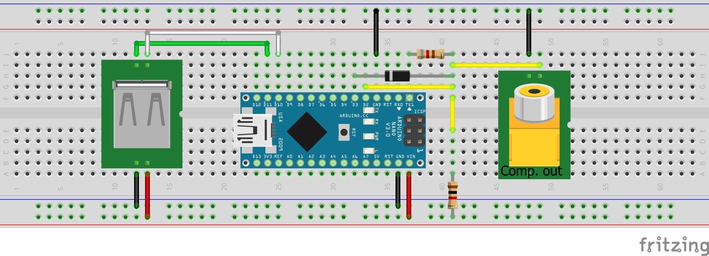

# Commodore 64 Emulator for Arduino
Open the [C64.ino](C64.ino) with Arduino IDE or any other IDE of you choice.

## Configuration
Uncomment ```#define NTSC``` in [C64.ino](C64.ino) if NTSC video is required. Note that there will be less performance left for BASIC programs when doing so. So prefer PAL, whenever possible.

## Hires mode (Arduino Mega only)
When running on an Arduino Mega, the 320x200 high resolution mode is available. This displays a black and white bitmap referred by the value of ```bnr``` in [bitmaps.h](bitmaps.h). The High resolution mode can be switched on with ````POKE 53265,32```. You can create own header files with bitmap data with the [hires](../Hires/README.md) converter.

## Schematic

## Breadboard


With an optional 100 pF capacitor parallel to the 820 Ohm resistor, the image might appear sharper on some analog devices.
