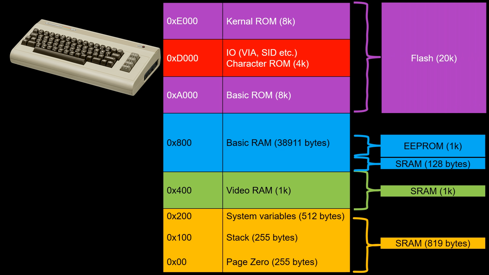
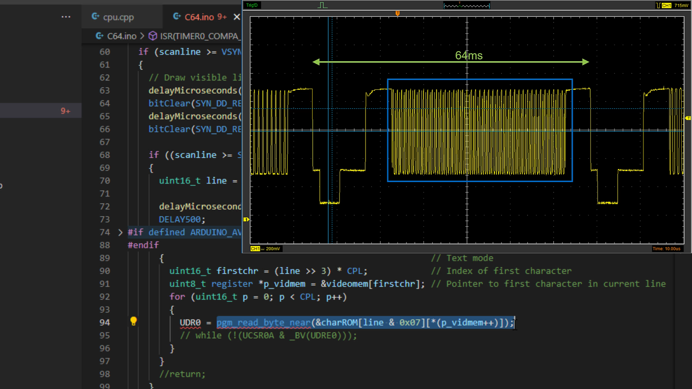
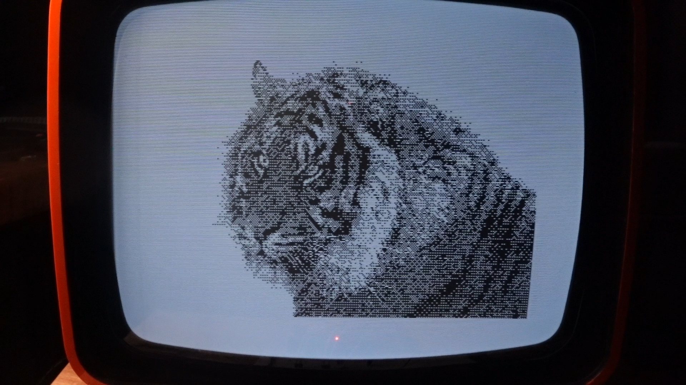
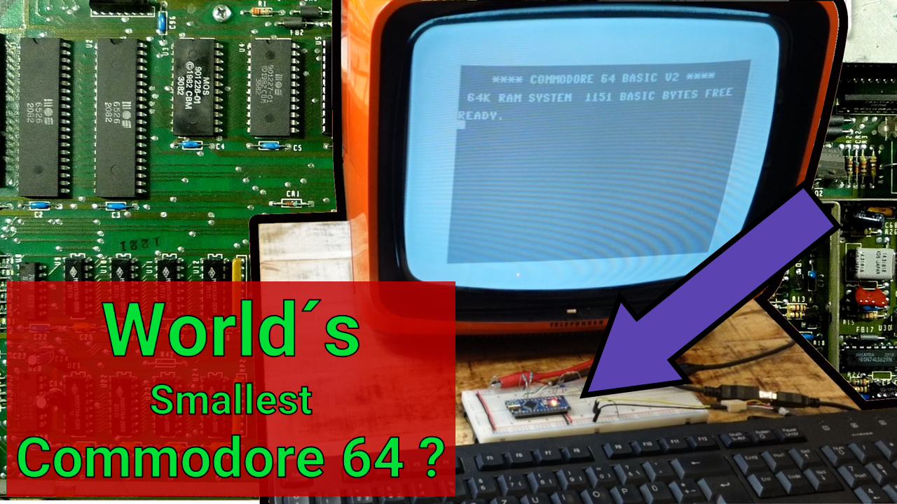

# The Arduino C64 Emulator
An Arduino is actually powerful enough to emulate a C64. With only a few external components it outputs PAL or NTSC video and can be connected to any TV or composite input of an analog monitor. This is a further development of the [Nano VIC-20](https://create.arduino.cc/projecthub/janost/the-nano-vic-20-e37b39) project by Jan Ostmann. 
The core is an emulator function for the MOS 6502/6510 CPU. This executes the 16 kilobytes of kernal and basic ROM code permanently stored in the Arduino's flash memory. The emulator maps the C64 memory areas to the Arduino memory as shown here:
\
\
 
\
\
\
Since the Uno/Nano has only 2k RAM, which is almost used up by the video RAM and the system itself, the 1k EEPROM there is also used as RAM.
PAL or NTSC composite video is generated by a timer interrupt routine which is called every 64ms (PAL) or every 63.5ms (NTSC). This outputs the sync pulses, the front and rear porch and clocks out the visible pixels using the shift register used for serial communication protocols such as UART, SPI, I2C. These three signals are then mixed together by a few external components.
\
\
  
\
\
\
A PS/2 or PS/2 compatible USB keyboard can be used to enter simple BASIC programs. I used the method described in another project to process the keyboard inputs on the Arduino: [Click here](https://create.arduino.cc/projecthub/michalin70/connect-a-usb-keyboard-with-an-arduino-50c077)
\
\

\
\
\
This is of course just an educational fun project. With only a little more than 1k RAM, no color, no graphics and sound capabilities, it is not possible to play any of the typical C64 games on it. However, when running on an Arduino Mega, we get 6000 bytes of BASIC RAM and a 320x200 pixel bitmap mode. The bitmaps can only be stored in flash memory, so BASIC programs can't change them. Note that there are still no colors, but only black and white.
\
\

## More
Install and [Run the emulator](C64/README.md)
\
Create [Hires header files](Hires/README.md)
\

## Video on Youtube
Watch video for more details
\

